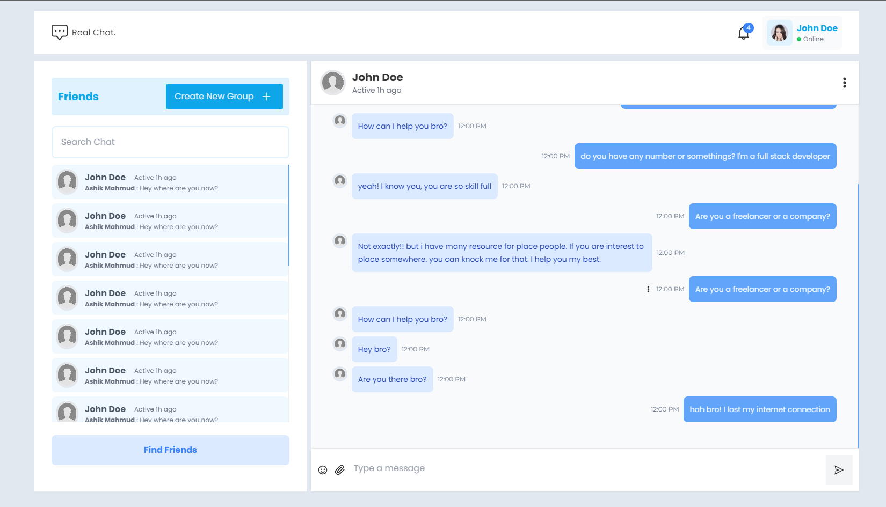

# Real Chat App - Client

This is the client side of the Real Chat App. It is a React app that uses the [Real Chat App - Server](https://github.com/Ashik-Mahmud/real-chat-app-server)

## Using Technologies

```json
{
  "name": "client",
  "version": "0.1.0",
  "private": true,
  "dependencies": {
    "@reduxjs/toolkit": "^1.8.1",
    "@testing-library/jest-dom": "^5.16.4",
    "@testing-library/react": "^13.0.1",
    "@testing-library/user-event": "^14.1.1",
    "@types/jest": "^27.4.1",
    "@types/node": "^17.0.25",
    "@types/react": "^18.0.6",
    "@types/react-dom": "^18.0.2",
    "axios": "^1.1.3",
    "cogo-toast": "2.0.1",
    "date-fns": "^2.29.3",
    "emoji-picker-react": "^4.4.5",
    "react": "^18.2.0",
    "react-cookie": "^4.1.1",
    "react-dom": "^18.2.0",
    "react-hook-form": "^7.39.4",
    "react-icons": "^4.6.0",
    "react-query": "^3.39.2",
    "react-redux": "^8.0.1",
    "react-router-dom": "6.4.3",
    "react-scripts": "5.0.1",
    "react-scroll-to-bottom": "^4.2.0",
    "react-select": "^5.6.1",
    "react-spinners": "^0.13.6",
    "socket.io-client": "^4.5.3",
    "sweetalert": "^2.1.2",
    "typescript": "^4.6.0",
    "universal-cookie": "^4.0.4",
    "web-vitals": "^2.1.0"
  },
  "scripts": {
    "start": "react-scripts start",
    "build": "react-scripts build",
    "test": "react-scripts test",
    "eject": "react-scripts eject"
  },
  "eslintConfig": {
    "extends": ["react-app", "react-app/jest"]
  },
  "browserslist": {
    "production": [">0.2%", "not dead", "not op_mini all"],
    "development": [
      "last 1 chrome version",
      "last 1 firefox version",
      "last 1 safari version"
    ]
  },
  "devDependencies": {
    "@types/react-scroll-to-bottom": "^4.2.0",
    "autoprefixer": "^10.4.13",
    "postcss": "^8.4.19",
    "tailwindcss": "^3.2.4"
  }
}
```

## Required Features

## Preview Image



> Thanks for reach out me on github. If you have any query please contact me.
